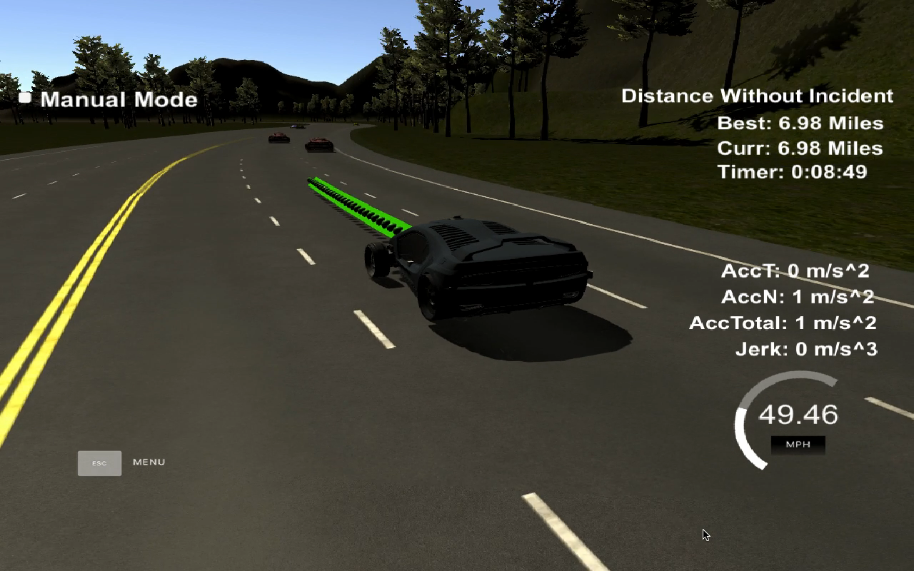

# CarND-Path-Planning-Project
Self-Driving Car Engineer Nanodegree Program

---

In this project, I utilized a behavior planner and spline function in order to drive a car around a simulated track, including performing lane changes as necessary when around traffic.

Following are the tasks performed on the stimulator to drive the vehicles smoothly. I was able to drive the vehicle more than 20 miles without any incident.

## Compilation

### The code compiles correctly.

No changes were made in the `cmake` configuration. A file named [spline.h](./scr/spline.h) was added in the *src* folder. It is the [Cubic Spline interpolation implementation](http://kluge.in-chemnitz.de/opensource/spline/): a single .h file you used to generate splines, as proposed in the video walk-through.

## Valid trajectories

### The car is able to drive at least 4.32 miles without incident.

I ran the simulator for more than 20 miles without any incident (but forgot to take a screenshot). Here is a picture of a run after at 6.98 miles and the [corresponding video](https://www.youtube.com/watch?v=OjR42v4IS4I&t=2s).



### The car drives according to the speed limit.

No speed limit message was seen.

### Max Acceleration and Jerk are not exceeded.

No max jerk message was seen.

### Car does not have collisions.

No collision message was seen.

### The car stays in its lane, except for the time between changing lanes.

The car stays in its lane, except to overtake another car (that is ahead) because of the traffic or to return to the center lane (to be able to more easily overtake a car that is ahead, by the left or the right).

### The car is able to change lanes

The car is able to smoothly change of lane when there is a slow car in front of it and that it is safe to change lanes (no other cars too close on the lane our car would move to), or when it is safe to return the center lane.

## Reflection

Based on the provided code from the seed project, the path planning algorithm starts at [src/main.cpp](./src/main.cpp#L246) line 189 to the line 383. 

I separated it into different functions to show the overall process, and I put comments in it.

The code consists of three parts:

### Prediction [line 189 to line 234](./src/main.cpp#L189)

Using sensor fusion, we get information about the surrounding environment and the properties of the cars around are captured; namely s, d, vx and vy for each car. [Lines 174-187](./scr/main.cpp#L174) are used to calculate the lane from the value of d. From vx and vy, we can calculate the speed of the vehicles around.

```c++
int getLane(double d)
{
  if (d >= 0 && d < 4){
		return 0;
	}
  else if (d >= 4 && d < 8){
		return 1;
	}
	else if (d >= 8 && d <= 12)
	{
		return 2;
	}
	return -1;
}
```

Using the s, d (lane), vx and vy values of the cars around, we check the following lane change conditions:

- Car ahead: If there is a car ahead within 30m.
  - what is the speed of the car ahead.
- Car left: If there is car on left 35m ahead or 10m behind us, making a lane change not safe
- Car right: If there is car on right 35m ahead or 10m behind us, making a lane change not safe
- Car far left: If there is car on far left 35m ahead or 10m behind us, making a lane change not safe
- Car far right: If there is car on far right 35m ahead or 10m behind us, making a lane change not safe

We're checking for the far left and right cars to avoid going from the far left or right lane to the center one, and therefore risk entering in a collision with another car that was going back to the center lane too from the other side of the road.

```c++
void prediction(vector<vector<double>> sensor_fusion, int lane, double car_s, int prev_size, bool & car_ahead, bool & car_left, bool & car_right, bool & car_far_left, bool & car_far_right, double & car_ahead_speed){
  for (int i = 0; i < sensor_fusion.size(); i++) {
    float check_car_d = sensor_fusion[i][6];
    int car_lane = getLane(check_car_d);
    if (car_lane == -1){
      continue;
    }
    // Find car speed.
    double vx = sensor_fusion[i][3];
    double vy = sensor_fusion[i][4];
    double check_car_speed = sqrt(vx*vx + vy*vy);
    double check_car_s = sensor_fusion[i][5];
    // Estimate car s position after executing previous trajectory.
    check_car_s += ((double) prev_size * .02 * check_car_speed);

    if (car_lane == lane) {
      // Car in our lane.
      if((check_car_s > car_s) && ((check_car_s-car_s) < 30)){
        car_ahead = true;
        car_ahead_speed = meps2miph(check_car_speed); // should check the speed following s
        //cout << "car_ahead_speed = "<< car_ahead_speed * 2.24 << endl;
      }

    }
    else if (car_lane - lane == -1) {
      if ((check_car_s > car_s && check_car_s - car_s < 35) || (check_car_s < car_s && car_s - check_car_s < 10)) {
        car_left = true;
      }
    }
    else if (car_lane - lane == -2) {
      if ((check_car_s > car_s && check_car_s - car_s < 10) || (check_car_s < car_s && car_s - check_car_s < 10)) {
        car_far_left = true;
      }
    }
    else if (car_lane - lane == 1) {
      if((check_car_s >car_s && check_car_s-car_s < 35) || (check_car_s < car_s && car_s-check_car_s < 10)){
        car_right = true;
      }
    }
    else if (car_lane - lane == 2) {
      if ((check_car_s > car_s && check_car_s - car_s < 10) || (check_car_s < car_s && car_s - check_car_s < 10)) {
        car_far_right = true;
      }
    }
  }
}
```

### Behavior [line 236 to line 261](./scr/main.cpp#L236)

Using the information of the cars around that we got by the *prediction* function, the car will decide the behavior to follow. It will be a combination of:

- Keep speed constant
- Acceleration
- Deceleration

And

- Stay on same lane
- Lane change left
- Lane change right

Based on the prediction of the situation we are in, this code decides if we have to increase or decrease the speed, or to make a lane change when it is safe. Instead of increasing the speed at this part of the code, a `speed_diff` is created to be used for speed changes when generating the trajectory in the last part of the code. This approach makes the car more responsive, acting faster to changing situations like a car in front of it applying the brakes and that could cause a collision.

```c++
void behavior_planner(bool car_ahead, bool car_left, bool car_right, bool car_far_left, bool car_far_right, double ref_vel, int & lane, double & speed_diff){
    if (car_ahead) { // Car ahead
        if (!car_left && lane > 0) {
            // if there is no car left and there is a left lane.
            lane--; // Change lane left
        } else if (!car_right && lane < NUMBER_OF_LANES - 1){
            // if there is no car right and there is a right lane.
            lane++; // Change lane right
        } else {
            speed_diff -= MAX_ACC;
        }
    } else { // No car ahead
        // Adapt for the case NUMBER_OF_LANES > 3
        if (lane != 1) { // if we are not on the center lane.
            if (lane == 0 && !car_right && !car_far_right){
                lane = 1; // Back to center
            }
            else if (lane == 2 && !car_left && !car_far_left){
                lane = 1; // Back to center
            }
        }
        if (ref_vel < MAX_SPEED) {
            speed_diff += MAX_ACC;
        }
    }
}
```

### Trajectory [line 263 to line 383](./scr/main.cpp#L263)

This code performs the trajectory calculation based on the speed and lane output from the *behavior_planner* function, our car coordinates and the past path points of the trajectory; as well as with the `car_ahead_speed`, to be able to follow that car at the same speed if we aren't changing lanes.

First, we extract the two last points from the previous generated trajectory, or the car position and direction to generate two first points if there is no previous trajectory. Then we generate 3 evenly 30m spaced points ahead of the starting reference, based on the lane of the vehicle.

In order to ensure more continuity on the trajectory (in addition to adding the last two point of the previous trajectory as first points of the spline object), the previous trajectory points are copied to the new trajectory. The rest of the points are then calculated by evaluating the spline (as presented in the walk-through), that will generate a smooth trajectory of 50 points. These generated trajectory points are then converted to local (x, y) coordinates and then passed to the simulator to drive the car.s

It is worth noticing the update in the velocity of the car for each point added to the trajectory. The speed change (acceleration or deceleration) is decided on the behavior part of the code, but it is used in that part to increase/decrease speed on every trajectory points instead of doing it for the complete trajectory. It also allows to adapt our speed to the speed of the car ahead of us if there is one.

```c++
void trajectory_planner(bool car_ahead, double car_ahead_speed, double & ref_vel, double speed_diff, vector<double> map_waypoints_s, vector<double> map_waypoints_x, vector<double> map_waypoints_y, int lane, double car_s, double car_x, double car_y, double car_yaw, int prev_size, vector<double> previous_path_x, vector<double> previous_path_y, vector<double> & next_x_vals, vector<double> & next_y_vals){
  // Create a list of widely spaced (x,y) waypoints, evenly spaced at 30m
  // Later we will interpolate these waypoints with a spline and fill it in with more points that control speed
  vector<double> ptsx;
  vector<double> ptsy;

  // reference x, y, yaw states
  // either we will reference the starting point as where the car is or at the previous path endpoint
  double ref_x = car_x;
  double ref_y = car_y;
  double ref_yaw = deg2rad(car_yaw);

  // if previous size is almost empty, use the car as starting reference
  if (prev_size < 2){
    // Use 2 points that make the path tangent to the car
    double prev_car_x = car_x - cos(car_yaw);
    double prev_car_y = car_y - sin(car_yaw);

    ptsx.push_back(prev_car_x);
    ptsx.push_back(car_x);

    ptsy.push_back(prev_car_y);
    ptsy.push_back(car_y);
  }
  // use the previous path endpoint as starting reference
  else {
    // redefine reference state as previous path endpoint
    ref_x = previous_path_x[prev_size - 1];
    ref_y = previous_path_y[prev_size - 1];

    double ref_x_prev = previous_path_x[prev_size - 2];
    double ref_y_prev = previous_path_y[prev_size - 2];

    ref_yaw = atan2(ref_y - ref_y_prev, ref_x - ref_x_prev);

    // Use 2 points that make the path tangent to the previous path endpoint
    ptsx.push_back(ref_x_prev);
    ptsx.push_back(ref_x);

    ptsy.push_back(ref_y_prev);
    ptsy.push_back(ref_y);
  }

  // In Frenet, add evenly 30m spaced points ahead of the starting reference
  vector<double> next_wp0 = getXY(car_s + 30, 2 + 4 * lane, map_waypoints_s, map_waypoints_x, map_waypoints_y);
  vector<double> next_wp1 = getXY(car_s + 60, 2 + 4 * lane, map_waypoints_s, map_waypoints_x, map_waypoints_y);
  vector<double> next_wp2 = getXY(car_s + 90, 2 + 4 * lane, map_waypoints_s, map_waypoints_x, map_waypoints_y);

  ptsx.push_back(next_wp0[0]);
  ptsx.push_back(next_wp1[0]);
  ptsx.push_back(next_wp2[0]);

  ptsy.push_back(next_wp0[1]);
  ptsy.push_back(next_wp1[1]);
  ptsy.push_back(next_wp2[1]);

  for (int i = 0; i < ptsx.size(); i++){
    // shift the car reference angle to 0 degrees (shift and rotation)
    double shift_x = ptsx[i] - ref_x;
    double shift_y = ptsy[i] - ref_y;

    ptsx[i] = shift_x * cos(0 - ref_yaw) - shift_y * sin(0 - ref_yaw);
    ptsy[i] = shift_x * sin(0 - ref_yaw) + shift_y * cos(0 - ref_yaw);
  }

  // Create a spline
  tk::spline s;

  // Set (x,y) points to the spline
  s.set_points(ptsx, ptsy);

  // Start with all the previous path points from last time
  for (int i = 0; i < prev_size; i++){
    next_x_vals.push_back(previous_path_x[i]);
    next_y_vals.push_back(previous_path_y[i]);
  }

  // Calculate how to break out spline points so that we travel at our desired reference velocity
  double target_x = 30.0;
  double target_y = s(target_x);
  double target_dist = sqrt(target_x*target_x+target_y*target_y);

  double x_add_on = 0;

  // Fill up the rest of our path planner after filling it with previous points, here we will always output 50 points
  for (int i = 1; i < 50 - prev_size; i++){
    ref_vel += speed_diff;
    if (ref_vel > MAX_SPEED) {
      ref_vel = MAX_SPEED;
    }
    else if (ref_vel < MAX_ACC) {
      ref_vel = MAX_ACC;
    }
    if (car_ahead){
      // cout << "car ahead" << endl;
      if (speed_diff < 0 && ref_vel < car_ahead_speed){
        // cout << "car_ahead_speed kept" << endl;
        ref_vel = car_ahead_speed;
      }
    }

    double N = target_dist / (.02 * miph2meps(ref_vel)); // 2.24: mph => m/s
    double x_point = x_add_on + target_x / N;
    double y_point = s(x_point);

    x_add_on = x_point;

    double x_ref = x_point;
    double y_ref = y_point;

    // rotate back to normal after rotating it earlier (change reference)
    x_point = x_ref * cos(ref_yaw) - y_ref * sin(ref_yaw);
    y_point = x_ref * sin(ref_yaw) + y_ref * cos(ref_yaw);

    x_point += ref_x;
    y_point += ref_y;

    next_x_vals.push_back(x_point);
    next_y_vals.push_back(y_point);
  }
}
```


## OLD README

### Simulator

You can download the Term3 Simulator which contains the Path Planning Project from the [releases tab (https://github.com/udacity/self-driving-car-sim/releases/tag/T3_v1.2).

### Goals
In this project your goal is to safely navigate around a virtual highway with other traffic that is driving +-10 MPH of the 50 MPH speed limit. You will be provided the car's localization and sensor fusion data, there is also a sparse map list of waypoints around the highway. The car should try to go as close as possible to the 50 MPH speed limit, which means passing slower traffic when possible, note that other cars will try to change lanes too. The car should avoid hitting other cars at all cost as well as driving inside of the marked road lanes at all times, unless going from one lane to another. The car should be able to make one complete loop around the 6946m highway. Since the car is trying to go 50 MPH, it should take a little over 5 minutes to complete 1 loop. Also the car should not experience total acceleration over 10 m/s^2 and jerk that is greater than 10 m/s^3.

#### The map of the highway is in data/highway_map.txt
Each waypoint in the list contains  [x,y,s,dx,dy] values. x and y are the waypoint's map coordinate position, the s value is the distance along the road to get to that waypoint in meters, the dx and dy values define the unit normal vector pointing outward of the highway loop.

The highway's waypoints loop around so the frenet s value, distance along the road, goes from 0 to 6945.554.

## Basic Build Instructions

1. Clone this repo.
2. Make a build directory: `mkdir build && cd build`
3. Compile: `cmake .. && make`
4. Run it: `./path_planning`.

Here is the data provided from the Simulator to the C++ Program

#### Main car's localization Data (No Noise)

["x"] The car's x position in map coordinates

["y"] The car's y position in map coordinates

["s"] The car's s position in frenet coordinates

["d"] The car's d position in frenet coordinates

["yaw"] The car's yaw angle in the map

["speed"] The car's speed in MPH

#### Previous path data given to the Planner

//Note: Return the previous list but with processed points removed, can be a nice tool to show how far along
the path has processed since last time. 

["previous_path_x"] The previous list of x points previously given to the simulator

["previous_path_y"] The previous list of y points previously given to the simulator

#### Previous path's end s and d values 

["end_path_s"] The previous list's last point's frenet s value

["end_path_d"] The previous list's last point's frenet d value

#### Sensor Fusion Data, a list of all other car's attributes on the same side of the road. (No Noise)

["sensor_fusion"] A 2d vector of cars and then that car's [car's unique ID, car's x position in map coordinates, car's y position in map coordinates, car's x velocity in m/s, car's y velocity in m/s, car's s position in frenet coordinates, car's d position in frenet coordinates. 

## Details

1. The car uses a perfect controller and will visit every (x,y) point it recieves in the list every .02 seconds. The units for the (x,y) points are in meters and the spacing of the points determines the speed of the car. The vector going from a point to the next point in the list dictates the angle of the car. Acceleration both in the tangential and normal directions is measured along with the jerk, the rate of change of total Acceleration. The (x,y) point paths that the planner recieves should not have a total acceleration that goes over 10 m/s^2, also the jerk should not go over 50 m/s^3. (NOTE: As this is BETA, these requirements might change. Also currently jerk is over a .02 second interval, it would probably be better to average total acceleration over 1 second and measure jerk from that.

2. There will be some latency between the simulator running and the path planner returning a path, with optimized code usually its not very long maybe just 1-3 time steps. During this delay the simulator will continue using points that it was last given, because of this its a good idea to store the last points you have used so you can have a smooth transition. previous_path_x, and previous_path_y can be helpful for this transition since they show the last points given to the simulator controller with the processed points already removed. You would either return a path that extends this previous path or make sure to create a new path that has a smooth transition with this last path.

## Tips

A really helpful resource for doing this project and creating smooth trajectories was using http://kluge.in-chemnitz.de/opensource/spline/, the spline function is in a single hearder file is really easy to use.

---

## Dependencies

* cmake >= 3.5
  * All OSes: [click here for installation instructions](https://cmake.org/install/)
* make >= 4.1
  * Linux: make is installed by default on most Linux distros
  * Mac: [install Xcode command line tools to get make](https://developer.apple.com/xcode/features/)
  * Windows: [Click here for installation instructions](http://gnuwin32.sourceforge.net/packages/make.htm)
* gcc/g++ >= 5.4
  * Linux: gcc / g++ is installed by default on most Linux distros
  * Mac: same deal as make - [install Xcode command line tools]((https://developer.apple.com/xcode/features/)
  * Windows: recommend using [MinGW](http://www.mingw.org/)
* [uWebSockets](https://github.com/uWebSockets/uWebSockets)
  * Run either `install-mac.sh` or `install-ubuntu.sh`.
  * If you install from source, checkout to commit `e94b6e1`, i.e.
    ```
    git clone https://github.com/uWebSockets/uWebSockets 
    cd uWebSockets
    git checkout e94b6e1
    ```

## Editor Settings

We've purposefully kept editor configuration files out of this repo in order to
keep it as simple and environment agnostic as possible. However, we recommend
using the following settings:

* indent using spaces
* set tab width to 2 spaces (keeps the matrices in source code aligned)

## Code Style

Please (do your best to) stick to [Google's C++ style guide](https://google.github.io/styleguide/cppguide.html).

## Project Instructions and Rubric

Note: regardless of the changes you make, your project must be buildable using
cmake and make!


## Call for IDE Profiles Pull Requests

Help your fellow students!

We decided to create Makefiles with cmake to keep this project as platform
agnostic as possible. Similarly, we omitted IDE profiles in order to ensure
that students don't feel pressured to use one IDE or another.

However! I'd love to help people get up and running with their IDEs of choice.
If you've created a profile for an IDE that you think other students would
appreciate, we'd love to have you add the requisite profile files and
instructions to ide_profiles/. For example if you wanted to add a VS Code
profile, you'd add:

* /ide_profiles/vscode/.vscode
* /ide_profiles/vscode/README.md

The README should explain what the profile does, how to take advantage of it,
and how to install it.

Frankly, I've never been involved in a project with multiple IDE profiles
before. I believe the best way to handle this would be to keep them out of the
repo root to avoid clutter. My expectation is that most profiles will include
instructions to copy files to a new location to get picked up by the IDE, but
that's just a guess.

One last note here: regardless of the IDE used, every submitted project must
still be compilable with cmake and make./

## How to write a README
A well written README file can enhance your project and portfolio.  Develop your abilities to create professional README files by completing [this free course](https://www.udacity.com/course/writing-readmes--ud777).

